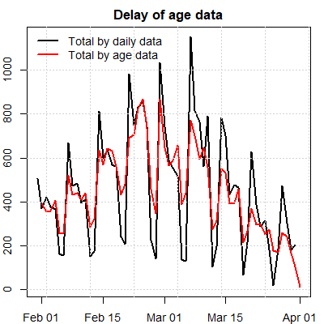

# COVID-19 in the Netherlands
_Author: Jay Lee_  
<i>Last update: Wed, Jul 13, 2022  7:44:02 PM</i>

Table of Contents
=================

* [Links and notes](#links-and-notes)
   * [Updates](#updates)
* [Netherlands](#netherlands)
   * [National trend](#national-trend)
   * [Hospital occupancy trends](#hospital-occupancy-trends)
      * [Lockdown prediction](#lockdown-prediction)
   * [Omicron](#omicron)
      * [ICU v. non-ICU](#icu-v-non-icu)
      * [Infections vs. new deaths](#infections-vs-new-deaths)
   * [Within NL cities/towns/provinces](#within-nl-citiestownsprovinces)
* [Trends in nearby countries](#trends-in-nearby-countries)
* [Covid by age](#covid-by-age)
   * [Cases by age group](#cases-by-age-group)
      * [Delay of age data](#delay-of-age-data)
   * [Hospitalization by age group](#hospitalization-by-age-group)
* [Other countries](#other-countries)
   * [Global and other countries](#global-and-other-countries)
   * [USA v. NL](#usa-v-nl)
* [Risk calculations](#risk-calculations)
   * [Booster protection](#booster-protection)
   * [Hospitalization risk](#hospitalization-risk)
   * [Personal risk](#personal-risk)
      * [Summary](#summary)
      * [The (wonky) math](#the-wonky-math)
* [Appendix](#appendix)
   * [Comparison to Spanish flu in the U.S.](#comparison-to-spanish-flu-in-the-us)
   * [Maths](#maths)
      * [Personal risk calculation math](#personal-risk-calculation-math)
      * [Basis for hospitalization risk](#basis-for-hospitalization-risk)
      * [Hospitalization risk by age](#hospitalization-risk-by-age)
   * [Code](#code)

header-includes: <link rel="icon" href="file:///C:/Users/60140jle/DROPBO~1/usr/proj/logos/cv.logo.png">  
  
  
  
  
  
# Links and notes  
  
* This document will be updated every few days or so.  
  - [**HTML**](https://bit.ly/covid_nl_html) (download and open in your own browser , easier to navigate since there's no pagination);  
  - [**PDF**](https://bit.ly/covid_nl_pdf) (view on Dropbox or download from there);  
  - [**GitHub**](https://github.com/JaySLee/covid/blob/main/README.md) (but in-text color not allowed on GitHub)  
* [121021:] [Report is now on GitHub](https://github.com/JaySLee/covid/blob/main/README.md)  
  - But the inline math is bottom-aligned with the surrounding text, so looks a bit clumsy.  
  - Also, colored text isn't rendered on GitHub.  
* Some dates are written U.S. style, so, e.g., 17.11.21 could appear as [111721:]  
* "Cases" = "infections".  
  
## Updates  
  
* 16.01.22: [Omicron seems to result in fewer hospitalizations and deaths](#omicron)  
* 29.12.21: Sources now include direct links to (some) csv data files.  
* 28.12.21:  
  1. [Comparison to Spanish flu (U.S.)](#comparison-to-spanish-flu-in-the-us)  
  2. [Lockdown prediction/expectation](#lockdown-prediction)  
* 20.11.21 - [Hospitalization risk by age](#hospitalization-risk-by-age)  
* 17.11.21 - [Covid by age](#covid-by-age)  
  
  
  
  
  
# Netherlands  
## National trend  
* [071322:] Latest new cases = 6808 (RIVMc), 6825 (RIVMn) &rarr; -539 (since yesterday)   
* <ins>Caveats:</ins>  
  - [041522:] LCPS (NL hospital data) no longer updated over the weekend.  
  - [040922:] RIVM no longer updated over the weekend. ~~LCPS is however.~~ Also, PCR testing not as common from this point forward, so less reliable of an indicator of infections.  
  - [011422:] It looks pretty clear -- given the lowering hospitalizations despite massive increase in infections -- that omicron is indeed less severe.  
    + Hence, one might want to focus on hospitalization numbers (to determine how much one should be alarmed or not on a given day :wink:); see [analysis below](#hospital-occupancy-trends).  
  - RIVMc is computed from the cumulative file while RIVMn is specifically new cases data. Not sure why there's a difference.  
  - [121421:] Dropping numbers may be deceiving. From Dutchnews.nl:  
> However, changes in the testing regime may have had an impact on the number of official cases. People with mild symptoms are now being told to take a self test first and only report to the regional health board testing centres if that test is positive. It is not yet clear if everyone who has a positive self test is following the new guidelines and requesting a confirmation check.  
  - [122921:] For occasional sudden drops then sudden increase on consecutive days (NLTimes):  
> ... it was about xxxx below average due to an IT error.   
  - Just remember: there are about 10x as many infectious ~~zombies~~ people wandering about compared to the latest reported daily new cases.  
    + [111821:] 23591*10 = ~236K = 1.35% of NL population  
    + [112121:] Looking at the infectious estimates produced by RIVM (that they kept updated until July, 2021), it seems this multiplier is more like 15x -- 20x.  
* [ca.120121:] We're ~~25%~~ ~~50% higher~~ nearly double than the last highest peak (Christmas/New Years 2020-21).  
* <ins>Legend:</ins>  
  - The figures below show raw (and log10) new case counts and deaths.  
    - Orange line is 7-day moving average.  
	- [022022:] GGD catch-up peak (400K) clipped in some of the plots.  
  - <ins>Horizontal lines:</ins> The dashed gray horizontal line indicates last count of new cases.  
  - <ins>Vaccinations:</ins>  
    - [010722:] Thick <green>**green**</green> line indicates % of total population ~~double~~ vaxxed (where 100% is level with the highest new cases point on the graph). Numbers are weekly.  
    - Dashed green line indicates % with only single dose.  
    - [010722:] Thick <blue>**blue**</blue> line indicates % of 18+ population boostered. RIVM updates numbers twice a week, so some flat areas will appear in the plot. I started collecting this only recently and RIVM does not publish historical numbers.  
	- [020222:] It seems double vaxxed numbers drops in the past month, ~~probably taking into account waning effectiveness of vax~~ because booster numbers seem to account for those double vaxxed, so double vaxxed numbers exclude boostered individuals. So, now green line depict _any_ vax.  
  - <ins>Lockdowns/measures:</ins>  
	- Colored _vertical lines_ indicate when restrictions are enacted (solid <red>red</red> vertical line) or lifted (dashed <green>green</green> vertical line).  
    - Thickness of line indicates severity of lockdown or extent of the loosening of restrictions.  
    - Based on observations farther below (and emphasis by the Prime Minister on hospital beds), it would seem that restrictions are imposed or lifted according to hospital occupancy and not number of infections. [See below](#lockdown-prediction).  
  

   
  
  

  
  
* Source: [RIVM](https://data.rivm.nl/covid-19/COVID-19_aantallen_gemeente_per_dag.csv) _(releases updated data daily at 15:15 CET, clicking on link acquires the new cases/city csv)_.  
  
  
  
## Hospital occupancy trends  
* [121021:] A few days ago, LCPS split ICU numbers by NL and "International" (i.e. in beds in Germany). Those are combined here.  
  - The latter includes "the number of COVID patients moved abroad from the Netherlands. This currently concerns COVID IC patients who have gone from the Netherlands to a hospital in Germany."  
* [112721:] Hospitalizations are &#128543;.  
* [111621:] Hospitalizations are not as dire as earlier this year and last year, but almost there :-/.  
  
  
  

  
  

  
  
### Lockdown prediction  
  
* [122821:] _<red>The findings here pertain to the above hospital plots.</red>_  
* As described above for infections/cases, _non-gray vertical lines in the above plots indicate when lockdowns are enacted_ (solid <red>red</red> vertical line) or lifted (dashed <green>green</green> vertical line).  
  - Thickness of line indicates severity of lockdown or extent of the loosening of restrictions.  
* Lockdown observations and prediction:  
  - Interestingly (and probably verifiable through LCPS), (hard) lockdowns appear to occur when non-ICU hospital bed occupancy is ~1750 and/or ICU bed occupancy is about 500.  
  - Significant ease of lockdowns seems to occur when non-ICU bed occupancy decreases to 500.  
  - [122821:] **Based on this pattern and assuming the occupancy trends continue, we can expect ease of current lockdown (at the earliest) near the beginning of February.** ~~the end of January 2022.~~  
    + Note that the announcement of a lockdown (or its removal) occurs a few days prior to the actual lockdown. Still, the observed intersections is likely not be coincidental since one can assume policy is partly based on predictive models.  
  - [011822:] Light loosening of restrictions occurred on 011522. The hospitalization numbers interestingly correspond with the 1st loosening back ca. middle of May, 2020 and June, 2021.  
  
* Source: [LCPS](https://lcps.nu/wp-content/uploads/covid-19-datafeed.csv) _(releases data daily between 1pm-2pm CET)_ and [Wikipedia](https://en.wikipedia.org/wiki/COVID-19_pandemic_in_the_Netherlands) for lockdown moments  
  
  
  
## Omicron  
  
* The colors indicate the date:  
  - Dark <blue>blue</blue> points are the earliest days of the pandemic (Mar 2020)  
  - _Hospital admissions data was unavailable until Oct 2020, while occupancy data was available as early as Mar 2020._  
  - Light <green>green</green>/yellow points are the middle of the pandemic.  
  - Dark <red>red</red>/brown points are the most recent dates.  
* Faint arrows indicated the temporal trajectory.  
* The points are sized by new daily deaths.  
* The grey, dashed diagonal bisects the plot.  
* Y-axis:  
  - Left plot: New daily hospitalizations (regular+ICU)  
  - Right plot: Hospital bed occupancy (regular+ICU)  
* [021722:] Visual space clipped to not show 400K new infections point (GGD catching up on delayed data).   
    

  
  
* <ins>Observations:</ins>  
  - **[020122:] Sudden uptick of admissions (ICU+non-ICU).**  
    - Either this is an artifact of data (collection) numbers or something more troubling, like an omicron variant or its penetrating a vulnerable subpopulation. Hospital by age data (published this Wednesday/020222) may tell us more.  
  - The dark blue arm -- at 12 o'clock -- represents the 1st wave when seemingly fewer infections incurred high hospitalization occupancy as well as deaths.  
    + However, covid testing was at its infancy in this period.  
  - The light blue arm represents the 2nd wave of the pandemic when fewer infections caused more hospitalizations and deaths.  
  - The red arm represents vaccination era, when infections led to fewer hospitalizations and deaths, than in the earlier days.  
  - **The dark red arm -- at three o'clock -- represents the omicron era, in which hospitalizations and deaths have seemed invariant to (even high) number of infections.**  
    + Interesting: there appears to be a similar horizontal invariance around the middle of the pandemic: <orange>orange</orange> points whose trajectory is rectangular/counter-clockwise.  
	+ The daily ICU admissions (as _y_-axis, but plot not shown) exhibit a similar pattern.  
  
  
  
  
The plots below log transform the _x_-axis (# of daily new infections), to stretch out those numbers.  
  

  
  
### ICU v. non-ICU  
  
Here, non-ICU hospital bed occupancy (_x_-axis) plotted against ICU bed occupancy (_y_-axis).  
- Points left of the diagonal could indicate more severe covid.  
- The unidimensional ratio can be seen in the purple line of plots of [2.2](#hospital-occupancy-trends).  
- Semi-circular trajectories might be explained by time gap for those moved from hospital to ICU bed.  
  

  
  
### Infections vs. new deaths  
  

  
  
  
  
## Within NL cities/towns/provinces  
  
* More new cases per capita in the smaller towns than national level.  
* Last 60 days only (otherwise, the plot becomes messy).  
* Both plots show 7 day moving average.  
* Cities ordered from worst to best (within those displayed).  
* Left plot: worst cities; right plot: Largest cities in NL (top 5%)  
* [NEW 121021:] Lower plot: provinces  
  

  

  
  
* Source: RIVM  
  
  
# Trends in nearby countries  
  
* As for countries near us: Belgium, Germany, Austria, and Denmark are also experiencing their own massive peaks, record-breaking for Germany and Austria. France is experiencing a minor surge.  
  

  

  
  
* Source: [CSSE](https://raw.githubusercontent.com/CSSEGISandData/COVID-19/master/csse_covid_19_data/csse_covid_19_time_series/time_series_covid19_confirmed_global.csv) _(data is one day behind the RIVM and LCPS data, clicking on link acquires the global confirmed cases csv)_  
  
  
  
# Covid by age  
  
## Cases by age group  
* Just the age groups of our students, at 3 levels of measurement.  
  - National (NL)  
  - Province (Zuid-Holland)  
  - Local (GGD Rotterdam)  
* RIVM groups ages by decade.  
* Smooth curves fit the data points (loess).  
* Upper plots show 7-day moving average.  
* Lower plots no moving average (but dates are more restricted for zooming).  
* Left plots shows **relative** proportion across all age groups.  
* Right plots shows absolute percentages within population of the age group.  
  - Also, in the right plots: <red>**_the last few rightmost points are incomplete (data), thus the sharp drop._**</red>  
  - On Nov 15, 2021, ~0.15% of all NL 20-29 year-olds were newly infected.  
    + They also constitute ~18% of the infected on the same date.  
  - Note: The denominator for the right plots is all youths in each age group across NL, for all three sources. Thus, the Province and Local percentages are less informative.  
* Sometimes, GGD Rotterdam throws up some extreme (high or low) values for last date.  
* <ins>Observations:</ins>  
  - A recent relative uptick of cases in the two relevant age groups.  
  - The percentages within age groups are more striking.  
  

 
  

 
  
  
Source: RIVM ([case/age csv](https://data.rivm.nl/covid-19/COVID-19_casus_landelijk.csv))  
  
  
  
  
  
### Delay of age data  
  
  
  
* Dates of case/age data are offset by ~~+3~~ +1 day in the plot below.  
* So two kinds of delays:  
  - RIVM country totals data (of all new cases) is behind the age data by ~~3~~ 1 days.  
  - But comprehensive age data for the past week is incomplete/delayed significantly.  
* Mid-Feb 2022 spike seems back-distributed.  
  
  
  
## Hospitalization by age group  
  
* _New hospitalization data comes out once a week, Wednesdays_.  
* [112421:] _There was a bug in my code that made these graphs inaccurate; fixed now._  
* Age groups of just EUR students and lecturers shown here.  
* LCPS groups age in 5-year bins.  
* LCPS releases these on a weekly basis.  
* First two plots show 7-day moving average.  
* Upper left plot shows relative proportion across all age groups.  
  - Young age groups are merged due to misalignment between hospital and case data.  
  - [112521:] _Relative proportion generally going down largely because of (relatively) more hospitizalizations in the older (not shown) age groups._  
* Upper right plot shows ratio of hospitalizations to number of cases.  
  - These proportions is an upper bound, as there are far more contagious cases thanindicated by a daily case number and also considering not all cases are registered by RIVM.  
  - [112521:]  
    - _Under that assumption, there is currently < 1% chance of hospitalization after infection._  
    - _The diminishing curves for the older age groups may be indicative of the vaccine's effectiveness._  
* The lower two plot shows _percentage_ within population of each age group.  
  - The right plot shows a LOESS regression fit.  
  - Because the recent week's LCPS age data (i.e. most recent date) are incomplete, points are omitted in these two plots.  
  - [112521:] _Hospitalizations (within age group) are going up for all age groups._  
  
  

 
  

 
  
  
Full time line (no moving average)  

  
  
Source: RIVM ([hospital/age csv](https://data.rivm.nl/covid-19/COVID-19_ziekenhuis_ic_opnames_per_leeftijdsgroep.csv))  
  
  
# Other countries  
## Global and other countries  
  
* Left plot is top 25 countries (in descending order), over the last 60 days.  
* Right plot contains various countries that came to my attention (e.g., being in the news) or of personal interest.  
  - Ordered by when the country came to my attention, and not by new cases.  
* The orange denotes the latest NL moving average (7 day) and not the latest daily new cases.  
* Both plots use 7-day moving average ("7day").  
   

 
  
  
## USA v. NL  
  
  
  
* Top plot:  
  - New infections per 100K  
  - 7 day moving average, last 60 days, top 25 states  
  - The <red>red</red>, 
white
, <blue>blue</blue> horizontal line is the US national average.  
* Lower left plot:  
  - New infections per 1M  
  - 7 day moving average, whole pandemic (for which there is data)  
* Lower right plot  
  - Same as previous but with deaths data.  
  

  
  

 
  
  
  
  
# Risk calculations  
## Booster protection  
  
<ins>021722:</ins>  
- Based on information presented in this [RIVM page](https://www.rivm.nl/en/news/booster-vaccination-prevents-many-hospital-and-ICU-admissions) ...  
  
&space;=&space;.0032\%)  
&space;=&space;.014\%)  
&space;=&space;.033\%)  
  
* Being boostered offers 10x more protection from hospitalization than being unvaxxed.  
* Being just vaxxed offers ~2.5x more protection.  
  
## Hospitalization risk  
  
<ins>**tl;dr:**</ins> (based on Nov 13, 2021 numbers)  
* Risk of getting covid, while being double vaxxed = 0.27%  
* Risk of hospitalization, given getting covid and vaxxed = 1.26% -- 2.53%  
* Risk of ICU, given getting covid and vaxxed = 0.40%  
  
These calculations are based on Nov. 13, 2021 numbers and some simplifying assumptions, that perhaps render the numbers below as upper bounds.  
  
* Probability of getting covid (), given being double vaxxed () vs. non-double vaxxed ():    
=0.27\%)  
=0.66\%)  
  
* For ages 10-19:  (see `f.cv.bayesv2()`)  
  - Based on Nov. 15, 2021 (peak for age/case data)  
  - Vacc/age v. Case/age groups don't perfectly align (consider interpolation or better data)  
  
  
  
* Probability of ending up hospitalized (), given being (double) vaxxed and having covid:    
&space;=&space;1.26\%&space;-&space;2.53\%)  
&space;=&space;1.29\%&space;-&space;2.58\%)   
  - The ranges are nearly equivalent largely b/c there are more people vaxxed than not. When hospital numbers -- between vax and non-vaxxed -- are near even but the vaxxed rate in the population goes higher, this means the vax is offering diminishing protection.  
  - Range is based on (perhaps severe) uncertainty over how many covid cases could be bound for hospital at any given time (10x v. 5x current new cases).  
  
* Probability of ending up in the ICU (), given being vaxxed and having covid:    
&space;=&space;0.40\%)  
&space;=&space;0.61\%)  
  
<ins>Assumptions:</ins>  
* Does not take into account clusters/heterogeneity of contacts and other factors, e.g., sociodemographics (namely **age**), students' self-quarantining, etc.  
* The above numbers are based on Nov 13, 2021 covid and hospitalization numbers.  
  - )  
* Unless stated otherwise, I use the assumption of there being 10x as many actual infectious people as reported by RIVM (which in its data shows this to be much higher).  
* Also, Google reported 67.6% of the NL population double vaxxed (when I last checked this number); the 83+% reported by NL times is based on the eligible population.  
  - As of 20.11.21, the vaccination proportion is 0.723.  
* Effectiveness of vaccine (given delta and time) has reportedly dropped to ~60% (pessimistic estimate).  
* &space;=&space;.45); &space;=&space;.65) (optimistic estimates) based on the following excerpt from an NL times report:  
  
> In October, just over half of all Covid-19 patients in the hospital were not or only partially vaccinated ... In ICU, the proportion of unvaccinated patients dropped from over 80 percent in September to about 70 percent in October.  
  
  
  
## Personal risk  
  
<ins>**_Caveats:_**</ins>  
* Some simplifying assumptions used here.  
* Covid numbers from Nov. 13, 2021.  
  
### Summary  
  
<ins>tl;dr: (too long didn't read):</ins>  
  
For those with 2 tutorials, the risk is a **18.1%** chance of catching covid over 8 weeks, conditioned on your being vaxxed.  
For those with 3 tutorials &rarr; **24.5%** risk.  
For JvD with 4 tutorials &rarr; **29.7%** risk.  
  
**85.0% chance at least one of the tutorial instructors will get covid sometime throughout Term 2.**  
* Remember these are pessimistic/upper bounds and don't fully consider students' self-quarantining.  
* Also, this doesn't take into account that none of us has yet gotten covid by week 2.  
  
### The (wonky) math  
  
1. First, we have the population of NL:  
  
2. Next, the reported number of new cases (on Nov. 13, 2021):  
  
 ... the multiplier that accounts for the number days a person could be infections and unreported cases; I'm conservative here as the rule of thumb is more like 10x.  
3. This gives us conservative estimate of total covid infectious people:  
    
4. Yielding the proportion of infectious people which estimates the probability of running into an infections person; this doesn't account for clusters of infection (e.g., Limburg):  

  
5. Next, we have the probability of covid's being transmitted () from an infected individual (). I use a more conservative number than the 0.632 reported (for a closed room):  
&space;=&space;0.2)  
6. So then, the probability of catching covid is (from any one person):  
\times&space;p(C)&space;=&space;p(T|C)p_c)  
  
7. The personal chances of catching covid over a period of time with multiple contacts:  
^k)) ... where  is number of people I run into.  
   - The inner part of the equation represents the chances of never running into covid -- after running into  people -- and having it be transmitted. The more enumerated version of this where I consider tramission probability for every  contact, i.e. chances with 1 contact, chances with 2 contacts, etc. ends up being equal to the above equation (math is funny!).  
  
8. <ins>Aside:</ins> let's see what the avg number of contacts across NL would be then:  
(1-(1-p_\text{C})^a)&space;=&space;2n_\text{C}) ... where  is avg number of daily social contacts (avged across all of NL) and  is est. of newly infected daily people (2x b/c of unreported)  
This gives us an average number of contacts (for all in NL):  
 ... which seems to be a reasonable avg (or even conservative).  
  
9. If I am proximal to 20 people (inc. students) every time I come to campus over 8 weeks (i.e. 8 instances), my personal risk is:  
^{(20\times8)})&space;=&space;.118&space;=&space;11.8\%) ... this is my chance -- assuming my vax status is unknown -- of catching covid during Term 2, giving the once-a-week recap lecture.  
   - This doesn't take into account that I'm vaccinated, in which case my risk is 6.0\%.  
   - _This is likely an upper bound as I don't consider students' self-quarantining._  
   - See [appendix](#personal-risk-calculation-math) for the math on the calculations of that 6.0\%.  
  
_For those with 2 tutorials:_  
- A conservative estimate of number of proximal contacts would be 20 (students) + 20 (extra people you might be proximal to each time you commute) = 40 people per week &rarr; **18.1%** chance of catching covid over 7 tutorial week, conditioned on your being vaxxed.  
- Overall risk (for both vaxxed and non-vaxxed) is 35.7%  
  
_For those with 3 tutorials_ &rarr; **24.5%** risk.  
- Overall risk (for both vaxxed and non-vaxxed) is 48.4%.  
  
_For JvD with 4 tutorials_ &rarr; **29.7%** risk.  
- Overall risk (for both vaxxed and non-vaxxed) is 58.5%  
  
_Across all 8 tutorial instructors_, average risk is:  
/8&space;=&space;.211) or 21.1\% // this approach is rough  
^8) = .850 = **85.0% chance at least one of the tutorial instructors will get covid**.  
* But remember this is an upper bound.  
* ^8&space;=&space;.150) &rarr; probability that none of the 8 ISA tutorial instructors get covid.  
  
  
# Appendix  
  
## Comparison to Spanish flu in the U.S.  
  
<ins>122821:</ins>  
* Estimated ~675K deaths due to Spanish flu. Population of U.S. at the time was 103M.  
  - <ins>Spanish flu mortality:</ins> **0.66%** of the U.S. population  
  - This estimate seems to include excess mortality, given reports of 590-600 (per 100K) all cause mortality (= ~0.6%)  
* ~817K (official) deaths due to COVID-19. However, total excess deaths is ~1.7M &rarr;  
  - <ins>COVID-19 mortality:</ins> **0.51%** of the U.S. population (so far)  
  - Macabre humor: Covid has four more months to catch up (in proportional U.S. deaths) to the Spanish flu, which lasted 2 years and 2 months (2.17 years).  
  - [040722:] So it's now April and we have ~982K &rarr; (assuming proportional excess deaths) &rarr; 0.62% COVID mortality for the U.S. population. So, COVID has almost caught up to Spanish flu levels of (relative) deaths in the U.S.  
  
## Maths  
  
### Personal risk calculation math  
  
Given probability of risk, whether or not I'm vaxxed:  
^{(20\times8)})&space;=&space;.118&space;=&space;11.8\%)  
  
We know the ratio of acquiring covid given vaxxed/non-vaxxed:  
}{p(C|\sim\\!\\!&space;V)}&space;=&space;\frac{.27}{.66})  
  
Let   
Then   
Now, letting   
We get   
  
  
We also realize the weighted sum using population ) numbers should result in that :  
)x&space;+&space;p(V)y&space;=&space;.118)  
Given &space;=&space;.676) // proportion of population vaxxed  
)ay&space;+&space;p(V)y&space;=&space;.118)  
ay&space;+&space;.676y&space;=&space;.118)  
ay&space;+&space;.676y&space;=&space;.118)  
y&space;=&space;.118)  
  
  
  
My risk over 8 weeks is   
  
  
### Basis for hospitalization risk  
_112021_  
  
Vaccine effectiveness = proportion of covid among unvaxxed minus proportion of covid among vaxxed, all divided by proportion of covid among unvaxxed.  
*  = number of unvaxxed people with covid  
*  = number of vaxxed people with covid  
*  = number of covid infections  
* ) = proportion of population vaxxed (really should be ))  
*  = NL population  
*  = vaccine effectiveness percentage, as a probability. Originally touted to be ~95%, I've reason to assume -- based on some reports -- that it's dropped to 60% due to the delta variant, so that's the value I use here.  
  
Let &space;=&space;\frac{n_C}{n}) // proportion of population with covid. One could just use  in lieu of ) below; not sure why I didn't do just that.  
)}&space;-&space;\frac{n_\text{c1}}{np(V)}&space;\right)&space;/&space;\left(&space;\frac{n_\text{c0}}{n(1-p(V))}&space;\right)) // vaccine effectiveness  
We now want to solve for number of infections within the vaxxed and unvaxxed,  and , respectively.  
}&space;/&space;\frac{n_\text{c0}}{n(1-p(V))}) // use a known E to solve for   
Let (1-E)}{n(1-p(V))})  
Yielding   
Given &space;=&space;n_\text{c1}&space;+&space;n_\text{c0})  
Then }{1+K}) // calculated unvaxxed count given known ,&space;p(C))  
and &nbsp; 
  
Probability of infection (), given vax () or non-vax ():  
&space;=&space;\frac{n_\text{c1}}{np(V)})  
&space;=&space;\frac{n_\text{c0}}{n(1-p(V))})  
  
Calculating probability of hospitalization () given vax and covid infection:  
&space;=&space;p(C|V)p(V)) // both are now known  
&space;=&space;p(V|H)&space;=&space;0.45) // from NL Times and also we're talking just about covid hospitalizations, i.e. we don't have to worry about non-covid hospitalizations since we have the numbers for covid hospitalizations. This makes &space;=&space;p(V|H,C)). The rest are known.  

  
  
### Hospitalization risk by age   
_112021_  
  
* Does not include vax status, yet.  
  
Probability of hosp given age and covid  
- LCPS=112021, hage=101121-111521, summed and normed,  
- page=`f.cv.age()`, cage=111521-112021, summed and normed  
-  = age group 10-19  
  

  
Same as above but for  = ages 50-59  

  
* Given : 10.5x worse than 10-19 stud, more C among studs makes ratio worse  
  - }{p(H|C,A=a_\text{students})})  
* Given just : only 6.8x worse b/c more people in older age group brings this down  
* For vacc, just use the above number and realize the &space;=&space;0.01) and &space;=&space;0.025).  
  - But not so straightforward given &space;=&space;.45).  
  
  
## Code  
  
* `f.cv.reset(); plot.cv.sav(yest=<number>)`  
* `cp_cv -cigo` // Chrome then copy to isa, dt, and gh  
* `f.cv.bayesv(n=17.44e6,pC=NULL,pVH=.35,pVC=NULL,pV=.676,pE=0.6,npC=13743*5,nH=353+1420)`  
* `f.cv.bayesv2()`  
  
