-*- markdown-command: "pandoc.sh -p -n -y -o" -*-
---
title: COVID-19 in the Netherlands
author: "_Author: Jay Lee_"
date: "<i>Last update: JLDATE</i>"
---
<!-- date: "<i>Last update: Nov. 18, 2021 (00:00)</i>" -->
ICON file:///C:/Users/60140jle/DROPBO~1/usr/proj/logos/cv.logo.png

<!-- # COVID-19 plots for Netherlands -->
<!-- _Author: Jay Lee_ -->
<!-- _Last update: Nov. 16, 2021 (00:52)_ -->

# Links and notes

* Latest version: [**HTML**](https://bit.ly/covid_nl_html) (download and open in your own browser), [**PDF**](https://bit.ly/covid_nl_pdf) (view on Dropbox or download from there)
* This document will be updated every few days or so.
* New additions:
  - 20.11.21 - [Hospitalization risk by age](#hospitalization-risk-by-age)
  - 17.11.21 - [Covid by age](#covid-by-age)

$\newcommand{\not}{{\Large \textasciitilde}\!}$
$\newcommand{\T}[1]{\text{#1}}$

<!-- https://www.dropbox.com/s/l0gzijia7uz58ia/COVID_NL.html?dl=1 -->
<!-- https://bit.ly/30pRtPZ -->
<!-- https://bit.ly/covid_nl_html -->
<!-- https://www.dropbox.com/s/nqgdyjenfips22e/COVID_NL.pdf?dl=0 -->
<!-- https://bit.ly/3DmPydh -->
<!-- https://bit.ly/covid_nl_pdf -->

# Netherlands
## National trend

<!-- * Latest new cases: 22956 (RIVMc), 23039 (RIVMn) -->
<!-- * Latest new cases = 23709 (RIVMc), 23789 (RIVMn) -->
<!-- * Latest new cases = 22184 (RIVMc), 22274 (RIVMn) -->
<!-- * Latest new cases = 22031 (RIVMc), 22089 (RIVMn) -->
<!-- * Latest new cases = 22133 (RIVMc), 22193 (RIVMn) -->
<!-- * Latest new cases = 21443 (RIVMc), 21552 (RIVMn) -->
<!-- * Latest new cases = 22154 (RIVMc), 22199 (RIVMn) &rarr; +677 -->
<!-- * Latest new cases = 18515 (RIVMc), 18588 (RIVMn) &rarr; -3611 -->
<!--   - Supposedly this drop is due to IT error (missing some reports). -->
<!-- * Latest new cases = 23043 (RIVMc), 23142 (RIVMn) &rarr; +4554 -->
<!-- * Latest new cases = 21529 (RIVMc), 21612 (RIVMn) &rarr; -1530 -->
<!-- * Latest new cases = 22613 (RIVMc), 22723 (RIVMn) &rarr; +1111 -->
<!-- * Latest new cases = 23078 (RIVMc), 23153 (RIVMn) &rarr; +430 -->
<!-- * Latest new cases = 20965 (RIVMc), 21053 (RIVMn) &rarr; -2100 (since yesterday) -->
<!-- * Latest new cases = 17911 (RIVMc), 18017 (RIVMn) &rarr; -3036 (since yest.) -->
<!-- * Latest new cases = 18062 (RIVMc), 18144 (RIVMn) &rarr; +127  -->
<!-- * Latest new cases = 19763 (RIVMc), 19838 (RIVMn) &rarr; +1694 -->
* Latest new cases = 17471 (RIVMc), 17562 (RIVMn) &rarr; -2276
  - RIVMc is computed from the cumulative file while RIVMn is specifically new cases data. Not sure why there's a difference.
* We're ~~25%~~ ~~50% higher~~ nearly double than the last highest peak (Christmas/New Years 2020-21).
* ~~While the numbers have dropped since yesterday (Friday, Nov. 19, 2021),~~ there's usually a drop in the reported numbers around the weekend, and then a surge in Monday/Tuesday.
* Just remember: there are about 10x as many infectious ~~zombies~~ people wandering about compared to the latest reported daily new cases.
  - ~~For NL on Nov. 15, 2021, this is 19054\*10 = ~200K (or over 1% of the NL population).~~
  - Nov. 18, 2021, 23591*10 = ~236K = 1.35% of NL population
  - [112121:] Looking at the infectious estimates produced by RIVM (that they kept updated until July, 2021), it seems this multiplier is more like 15x -- 20x.
* The figures below show raw new case counts (no moving average) and deaths (7 day moving average).
* Red line indicates last count; green line = 7 day moving average

<!-- 
 {width=70%} 
 -->

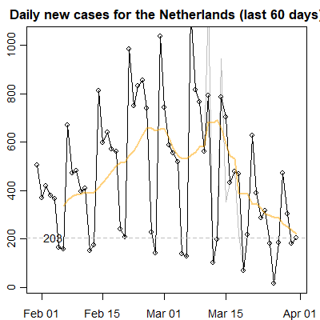{width=40%}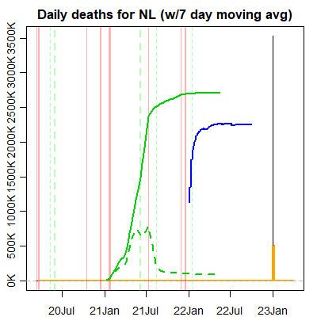{width=40%} 

* Source: RIVM _(releases updated data daily at 15:15 CET)_

## Hospital occupancy trends
* [121021:] A few days ago, LCPS split ICU numbers by NL and "International" (i.e. in beds in Germany). Those are combined here.
  - The latter includes "the number of COVID patients moved abroad from the Netherlands. This currently concerns COVID IC patients who have gone from the Netherlands to a hospital in Germany."
* [112721:] Hospitalizations are &#128543;.
* [111621:] Hospitalizations are not as dire as earlier this year and last year, but almost there :-/.

<!-- 
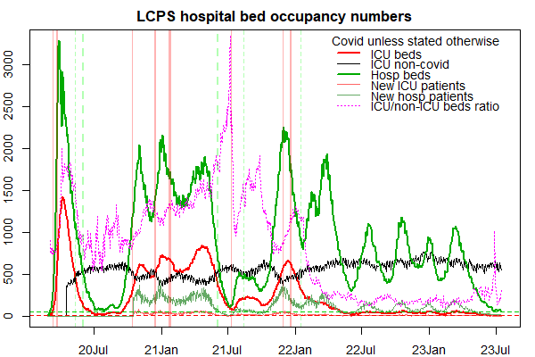{width=70%}
 -->

{width=70%}

{width=40%}

* Source: LCPS _(releases data daily between 1pm-2pm CET)_

## Within NL cities/towns/provinces

* More new cases per capita in the smaller towns than national level.
* Last 60 days only (otherwise, the plot becomes messy).
* Both plots show 7 day moving average.
* Cities ordered from worst to best (within those displayed).
* Left plot: worst cities; right plot: Largest cities in NL (top 5%)
* [NEW 121021:] Lower plot: provinces

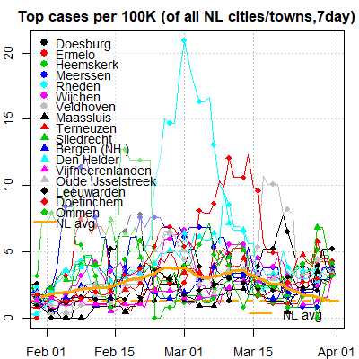{width=48%}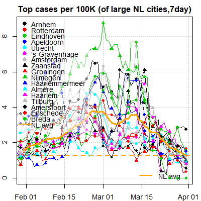{width=48%}

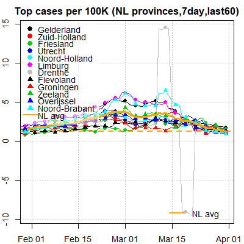{width=48%}

* Source: RIVM

# Trends in nearby countries

* As for countries near us: Belgium, Germany, Austria, and Denmark are also experiencing their own massive peaks, record-breaking for Germany and Austria. France is experiencing a minor surge.

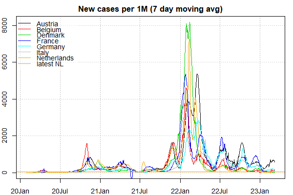{width=70%}

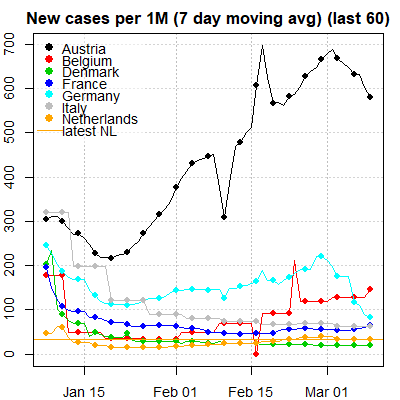{width=40%}

* Source: CSSE (data is one day behind the RIVM and LCPS data)

# Covid by age

## Cases by age group
* Just the age groups of our students, at 3 levels of measurement.
  - National (NL)
  - Province (Zuid-Holland)
  - Local (GGD Rotterdam)
* RIVM groups ages by decade.
* Smooth curves fit the data points (loess).
* Upper plots show 7-day moving average.
* Lower plots no moving average (but dates are more restricted for zooming).
* Left plots shows **relative** proportion across all age groups.
* Right plots shows absolute percentages within population of the age group.
  - Also, in the right plots: <red>**_the last/rightmost 6-8 points are incomplete (data), thus the sharp drop._**</red>
  - On Nov 15, 2021, ~0.15% of all NL 20-29 year-olds have covid.
    + They also constitute ~18% of the infected on the same date.
* GGD Rotterdam throws up some extreme values for last date.
* [Observation:]{.ul}
  - A recent relative uptick of cases in the two relevant age groups.
  - The percentages within age groups are more striking.

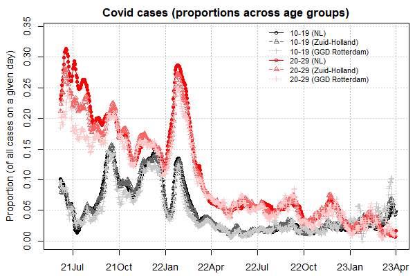{width=48%} 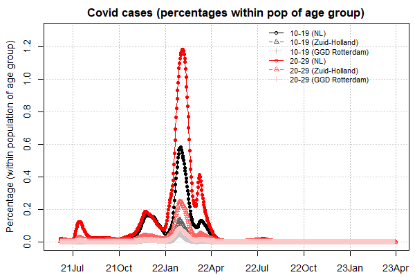{width=48%}
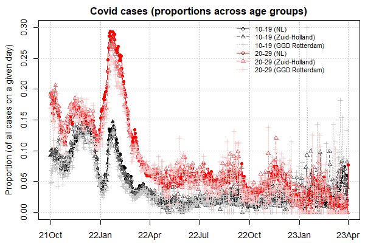{width=48%} 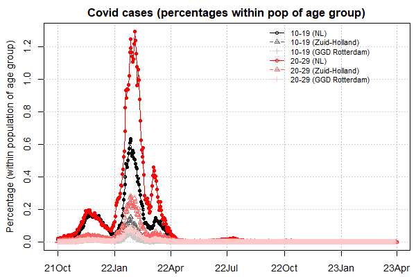{width=48%}

<!-- 

 -->

### Delay of age data

<!-- * Dates of case/age data are offset by +3 days in the plot below. -->
<!-- * So two kinds of delays: -->
<!--   - RIVM country totals data (of all new cases) is behind the age data by 3 days. -->
<!--   - But latest age data is incomplete/delayed significantly. -->

<!-- 
 {width=30%} 
 -->
<!-- {: style="float: right"} // doesn't work -->

* Dates of case/age data are offset by +3 days in the plot below.
* So two kinds of delays:
  - RIVM country totals data (of all new cases) is behind the age data by 3 days.
  - But comprehensive age data for the past week is incomplete/delayed significantly.

## Hospitalization by age group

* _Hospitalization data is updated once a week, Wednesdays_.
* [112421:] _There was a bug in my code that made these graphs inaccurate; fixed now._
* Age groups of just EUR students and lecturers shown here.
* LCPS groups age in 5-year bins.
* LCPS releases these on a weekly basis.
* First two plots show 7-day moving average.
* Upper left plot shows relative proportion across all age groups.
<!-- * The left plot shows relative proportion across all age groups -->
  - Young age groups are merged due to misalignment between hospital and case data.
  - _Relative proportion generally going down largely because of (relatively) more hospitizalizations in the older (not shown) age groups._
* Upper right plot shows ratio of hospitalizations to number of cases.
  - These proportions is an upper bound, as there are far more contagious cases thanindicated by a daily case number and also considering not all cases are registered by RIVM.
  - _Under that assumption, there is currently < 1% chance of hospitalization after infection._
  - _The diminishing curves for the older age groups may be indicative of the vaccine's effectiveness._
* The lower two plot shows _percentage_ within population of each age group.
  - The right plot shows a LOESS regression fit.
  - Because the recent week's LCPS age data (i.e. most recent date) are incomplete, points are omitted in these two plots.
  - _Hospitalizations are going up for all age groups._

<!-- * [Observations:]{.ul} -->
  <!-- - An uptick in recent (proportional) hospitalization for 15-19, 35-39, and 50-54 (more visible in the loess plot). -->
  <!-- - However, what's unknown is the extent to which these age groups are putting themselves more at risk. -->

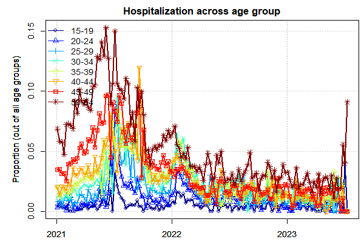{width=48%} {width=48%} 

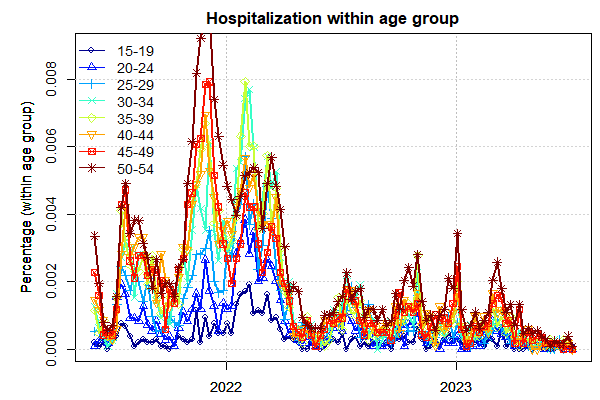{width=48%} 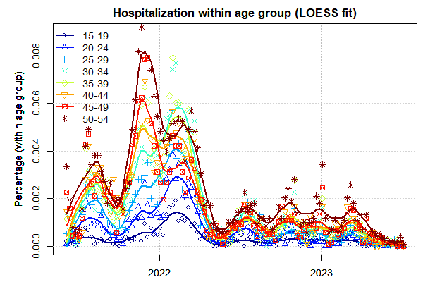{width=48%}

# Risk calculations
## Hospitalization risk

[**tl;dr:**]{.ul} (based on Nov 13, 2021 numbers)
* Risk of getting covid, while being double vaxxed = 0.27%
* Risk of hospitalization, given getting covid and vaxxed = 1.26% -- 2.53%
* Risk of ICU, given getting covid and vaxxed = 0.40%

These calculations are based on Nov. 13, 2021 numbers and some simplifying assumptions, that perhaps render the numbers below as upper bounds.

* Probability of getting covid ($C$), given being double vaxxed ($V$) vs. non-double vaxxed ($\not V$):  
$p(C|V) = 0.27\%$
$p(C|\not V) = 0.66\%$
* For ages 10-19: $1.00\%, 2.50\%$ (see `f.cv.bayesv2()`)
  - Based on Nov. 15, 2021 (peak for age/case data)
  - Vacc/age v. Case/age groups don't perfectly align (consider interpolation or better data)

<!-- $\begin{align} -->
<!-- p(C|V) &= 0.27\% \\ -->
<!-- p(C|\not V) &= 0.66\% -->
<!-- \end{align}$ DOESNT LOOK QUITE GOOD-->

<!-- $\begin{array}{r@{=}l} -->
<!-- p(C|V) &= 0.27\% \\ -->
<!-- p(C|\not V) &= 0.66\% -->
<!-- \end{array}$ -->

* <!p>Probability of ending up hospitalized ($H$), given being (double) vaxxed and having covid:  
$p(H|V\&C) = 1.26\%$ - $2.53\%$
$p(H|\not V\&C) = 1.29\%$ - $2.58\%$ 
   - The ranges are nearly equivalent largely b/c there are more people vaxxed than not. When hospital numbers -- between vax and non-vaxxed -- are near even but the vaxxed rate in the population goes higher, this means the vax is offering diminishing protection.
   - Range is based on (perhaps severe) uncertainty over how many covid cases could be bound for hospital at any given time (10x v. 5x current new cases).
<!-- $p(H|V\&C) = 1.62\%$ - $2.55\%$; $p(H|\not V\&C) = 1.65\%$ - $2.60\%$ // nearly equivalent NOT SURE HOW IT GOT 1.62 AND 1.65, I CAN SORT OF SEE WHERE -->

* Probability of ending up in the ICU ($I$), given being vaxxed and having covid:  
$p(I|V\&C) = 0.40\%$
$p(I|\not V\&C) = 0.61\%$

[Assumptions:]{.ul}
* Does not take into account clusters/heterogeneity of contacts and other factors, e.g., sociodemographics (namely **age**), students' self-quarantining, etc.
* The above numbers are based on Nov 13, 2021 covid and hospitalization numbers.
  - $n_C = 13743$, $n_{H|C} = (353+1402)$
* Unless stated otherwise, I use the assumption of there being 10x as many actual infectious people as reported by RIVM (which in its data shows this to be much higher).
* Also, Google reported 67.6% of the NL population double vaxxed (when I last checked this number); the 83+% reported by NL times is based on the eligible population.
  - As of 20.11.21, the vaccination proportion is 0.723.
* Effectiveness of vaccine (given delta and time) has reportedly dropped to ~60% (pessimistic estimate).
* $p(V|H) = .45$; $p(V|I) = .65$ (optimistic estimates) based on the following excerpt from an NL times report:

> In October, just over half of all Covid-19 patients in the hospital were not or only partially vaccinated ... In ICU, the proportion of unvaccinated patients dropped from over 80 percent in September to about 70 percent in October.

## Personal risk

<!-- $\begin{align} -->
<!-- n_\T{pop} &= 17.44M & \T{// population of NL} \\ -->
<!-- n_\T{c0} &= 13743 & \T{// number of reported new cases on Nov. 13, 2021} \\ -->
<!-- m &= 5 & \T{// multiplier (inc. \# of days a person could be infections and unreported cases*)} \\ -->
<!-- n_\T{c} &= n_\T{c0} \times m & \T{// conservative estimate of total covid infectious people (i.e. 5 days infections)} \\ -->
<!-- p_c &= \frac{n_\T{c}}{n_\T{pop}} &\T{// proportion of infectious = probability of running into an infectious person} \\ -->
<!--     &= 0.00394\\ -->
<!-- p_T &= .2 &\T{// conservative est. of probability of transmission (in a closed room, this is estimated to be .632)}\\ -->
<!-- p_C &= p_cp_T &\T{// probability of catching covid} -->
<!-- \end{align}$ -->
<!-- For some reason Chrome kills the math in combination with the non $$ raw math below -->
[**_Caveats:_**]{.ul}
* Some simplifying assumptions used here.
* Covid numbers from Nov. 13, 2021.

### Summary

[tl;dr: (too long didn't read):]{.ul}

For those with 2 tutorials, the risk is a **18.1%** chance of catching covid over 8 weeks, conditioned on your being vaxxed.
For those with 3 tutorials &rarr; **24.5%** risk.
For Julia with 4 tutorials &rarr; **29.7%** risk.

**85.0% chance at least one of the tutorial instructors will get covid sometime throughout Term 2.**
* Remember these are pessimistic/upper bounds and don't fully consider students' self-quarantining.
* Also, this doesn't take into account that none of us has yet gotten covid by week 2.

### The (wonky) math

1. First, we have the population of NL:
$n_\T{pop} = 17.44M$
2. Next, the reported number of new cases (on Nov. 13, 2021):
$n_\T{c0} = 13743$
$m = 5$ ... the multiplier that accounts for the number days a person could be infections and unreported cases; I'm conservative here as the rule of thumb is more like 10x.
3. This gives us conservative estimate of total covid infectious people:
$n_\T{c} = n_\T{c0} \times m$

4. Yielding the proportion of infectious people which estimates the probability of running into an infections person; this doesn't account for clusters of infection (e.g., Limburg):
$\begin{align}
p_\T{c} &= \frac{n_\T{c}}{n_\T{pop}}\\
    &= 0.00394
\end{align}$	 

5. Next, we have the probability of covid's being transmitted ($T$) from an infected individual ($C$). I use a more conservative number than the 0.632 reported (for a closed room):
$p(T|C) = 0.2$
6. So then, the probability of catching covid is (from any one person):
$p_\T{C1} = p(T|C)\times p(C) = p(T|C)p_c$

7. The personal chances of catching covid over a period of time with multiple contacts:
$p_\T{C} = (1-(1-p_\T{C1})^k)$ ... where $k$ is number of people I run into.
   - The inner part of the equation represents the chances of never running into covid -- after running into $k$ people -- and having it be transmitted. The more enumerated version of this where I consider tramission probability for every $k$ contact, i.e. chances with 1 contact, chances with 2 contacts, etc. ends up being equal to the above equation (math is funny!).

8. [Aside:]{.ul} let's see what the avg number of contacts across NL would be then:
$(n_\T{pop} - n_\T{c})(1-(1-p_\T{C})^a) = 2n_\T{C}$ ... where $a$ is avg number of daily social contacts (avged across all of NL) and $2n_C$ is est. of newly infected daily people (2x b/c of unreported)
This gives us an average number of contacts (for all in NL):
$a \approx 2$ ... which seems to be a reasonable avg.

9. If I am proximal to 20 people (inc. students) every time I come to campus over 8 weeks (i.e. 8 instances), my personal risk is:
$(1-(1-p_\T{C})^{(20\times8)}) = .118 = 11.8\%$ ... this is my chance -- assuming my vax status is unknown -- of catching covid during Term 2, giving the once-a-week recap lecture.
   - This doesn't take into account that I'm vaccinated, in which case my risk is 6.0\%.
   - _This is likely an upper bound as I don't consider students' self-quarantining._
   - See [appendix](#personal-risk-calculation-math) for the math on the calculations of that 6.0\%.

_For those with 2 tutorials:_
- A conservative estimate of number of proximal contacts would be 20 (students) + 20 (extra people you might be proximal to each time you commute) = 40 people per week &rarr; **18.1%** chance of catching covid over 7 tutorial week, conditioned on your being vaxxed.
- Overall risk (for both vaxxed and non-vaxxed) is 35.7%

_For those with 3 tutorials_ &rarr; **24.5%** risk.
- Overall risk (for both vaxxed and non-vaxxed) is 48.4%.

_For Julia with 4 tutorials_ &rarr; **29.7%** risk.
- Overall risk (for both vaxxed and non-vaxxed) is 58.5%

<!p>_Across all 8 tutorial instructors_, average risk is:
$(.181\times5+.245\times2+.297\times1)/8 = .211$ or 21.1\% // this approach is rough
$1-(1-.211)^8$ = .850 = **85.0% chance at least one of the tutorial instructors will get covid**.
* But remember this is an upper bound.
* $(1-.211)^8 = .150$ &rarr; probability that none of the 8 ISA tutorial instructors get covid.

# Appendix

## Global and other countries

* Left plot is top 25 countries (in descending order), over the last 60 days.
* Right plot contains various countries that came to my attention (e.g., being in the news) or of personal interest.
  - Ordered by when the country came to my attention, and not by new cases.
* The orange denotes the latest NL moving average (7 day) and not the latest daily new cases.
* Both plots use 7-day moving average ("7day").
 
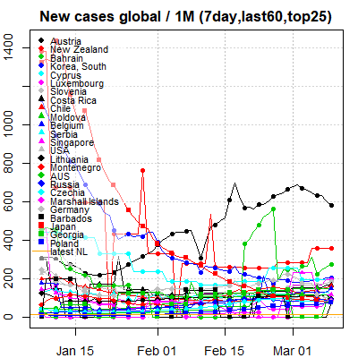{width=48%} 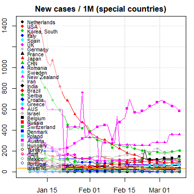{width=48%}

## USA

<!-- Before 
Hello world!
 after -->

* Top plot:
  - New infections per 100K
  - 7 day moving average, last 60 days, top 25 states
  - The <red>red</red>, 
white
, <blue>blue</blue> horizontal line is the national average.
* Lower left plot:
  - New infections per 1M
  - 7 day moving average, whole pandemic (for which there is data)
* Lower right plot
  - Same as previous but with deaths data.

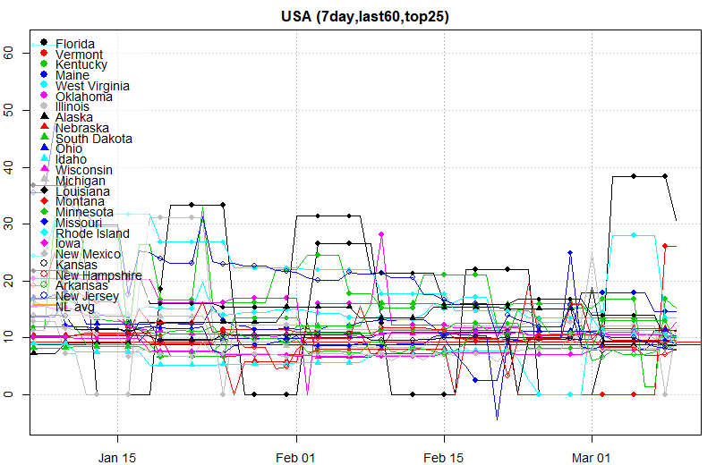{width=70%}

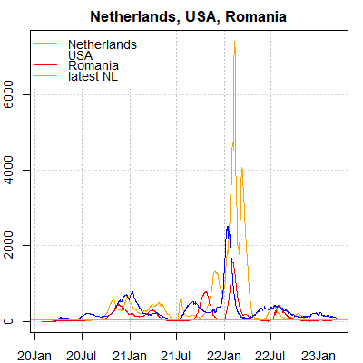{width=48%} 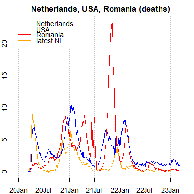{width=48%}

## Maths

### Personal risk calculation math

Given probability of risk, whether or not I'm vaxxed:
$(1-(1-p_\T{C})^{(20\times8)}) = .118 = 11.8\%$

We know the ratio of acquiring covid given vaxxed/non-vaxxed:
$\frac{p(C|V)}{p(C|\not V)} = \frac{.27}{.66}$

Let $\frac{x}{y} = \frac{.27}{.66}$
Then $x = \frac{.27y}{.66}$
Now, leting $a = \frac{.27}{.66}$
We get $x = ay$

<!-- .66x=.27y -->
<!-- x = .27y/.66 -->
<!-- let a = .27/.66 -->

We also realize the weighted sum using population $p(V)$ numbers should result in that $.118$:
$(1-p(V))x + p(V)y = .118$
Given $p(V) = .676$ // proportion of population vaxxed
$(1-p(V))ay + p(V)y = .118$
$(1-.676)ay + .676y = .118$
$ay - (.676)ay + .676y = .118$
$(a - .676a + .676)y = .118$
$y = .146$
$x = .060$

My risk over 8 weeks is $.060 = 6.0\%$

### Basis for hospitalization risk
_112021_

Vaccine effectiveness = proportion of covid among unvaxxed minus proportion of covid among vaxxed, all divided by proportion of covid among unvaxxed.
* $n_\T{c0}$ = number of unvaxxed people with covid
* $n_\T{c1}$ = number of vaxxed people with covid
* $n_C$ = number of covid infections
* $p(V)$ = proportion of population vaxxed (really should be $\T{Pr}(V)$)
* $n$ = NL population
* $E$ = vaccine effectiveness percentage, as a probability. Originally touted to be ~95%, I've reason to assume -- based on some reports -- that it's dropped to 60% due to the delta variant, so that's the value I use here.

Let $p(C) = \frac{n_C}{n}$ // proportion of population with covid. One could just use $n_C$ in lieu of $np(C)$ below; not sure why I didn't do just that.
$E = \left( \frac{n_\T{c0}}{n(1-p(V))} - \frac{n_\T{c1}}{np(V)} \right) / \left( \frac{n_\T{c0}}{n(1-p(V))} \right)$ // vaccine effectiveness
We now want to solve for number of infections within the vaxxed and unvaxxed, $n_\T{c1}$ and $n_\T{c0}$, respectively.
$E = 1 - \frac{n_\T{c1}}{np(V)} / \frac{n_\T{c0}}{n(1-p(V))}$ // use a known E to solve for $n_\T{c0}$
Let $K = \frac{np(V)(1-E)}{n(1-p(V)}$
Yielding $n_\T{c1} = Kn_\T{c0}$
Given $np(C) = n_\T{c1} + n_\T{c0}$
Then $n_\T{c0} = \frac{np(C)}{1+K}$ // calculated unvaxxed count given known $E, n, p(V), p(C)$
and &nbsp; $\begin{align}
n_\T{c1} &= np(C) - n_\T{c0}\\
         &= \frac{Knp(C)}{K+1}
\end{align}$

Probability of infection ($C$), given vax ($V$) or non-vax ($\not V$):
$p(C|V) = \frac{n_\T{c1}}{np(V)}$
$p(C|\not V) = \frac{n_\T{c0}}{n(1-p(V))}$

Calculating probability of hospitalization ($H$) given vax and covid infection:
$p(V,C) = p(C|V)p(V)$ // both are now known
$p(V|H,C) = p(V|H) = 0.45$ // from NL Times and also we're talking just about covid hospitalizations, i.e. we don't have to worry about non-covid hospitalizations since we have the numbers for covid hospitalizations. This makes $p(V|H) = p(V|H,C)$. The rest are known.
$\begin{align}
p(H|V,C) &= \frac{p(V|H,C)p(H,C)}{p(V,C)} \\
         &= \frac{0.45\times p(H|C)p(C)}{p(C|V)p(V)}
\end{align}$ 

### Hospitalization risk by age 
_112021_

* Does not include vax status, yet.

Probability of hosp given age and covid
- LCPS=112021, hage=101121-111521, summed and normed,
- page=`f.cv.age()`, cage=111521-112021, summed and normed
- $a$ = age group 10-19

$\begin{align}
p(H|A=a,C) &= p(A=a|H,C)p(H,C) / p(A=a|C) \\ 
		   &= (0.003750493+0.009080142)*(432+1785)/(21873) / .164 \\
		   &= 0.007929789\\
p(H|A=a)   &= (0.003750493+0.009080142)*(432+1785)/(17.44e6)/(0.055+0.060) \\
		   &= 1.418305e-05 
\end{align}$

Same as above but for $a$ = ages 50-59
$\begin{align}
p(H|A=a,C) &= (0.050927754+0.060205290)*(432+1785)/(21873) / .135 \\
	       &=  0.08343856 \\
p(H|A=a)   &= (0.050927754+0.060205290)*(432+1785)/(17.44e6) /(.074+.072) \\
		   &= 9.676305e-05
\end{align}$

* Given $A,C$: 10.5x worse than 10-19 stud, more C among studs makes ratio worse
  - $\frac{p(H|C,A=a_\T{teach})}{p(H|C,A=a_\T{students})}$
* Given just $A$: only 6.8x worse b/c more people my age brings this down
* For vacc, just use the above number and realize the $p(C|V,A) = 0.01$ and $p(C|\not V,A) = 0.025$.
  - But not so straightforward given $p(V|H) = .45$.

## Code

* `f.cv.plot.sav()` // defaults to all modes 0-4
* `f.cv.bayesv(n=17.44e6,pC=NULL,pVH=.35,pVC=NULL,pV=.676,pE=0.6,npC=13743*5,nH=353+1420)`
* `f.cv.plot.sav()`
* ~~`electron-pdf cv.html cv.html.pdf`~~
* `cp_cv -ci` // Chrome then copy to isa
* `f.cv.bayesv2()`

